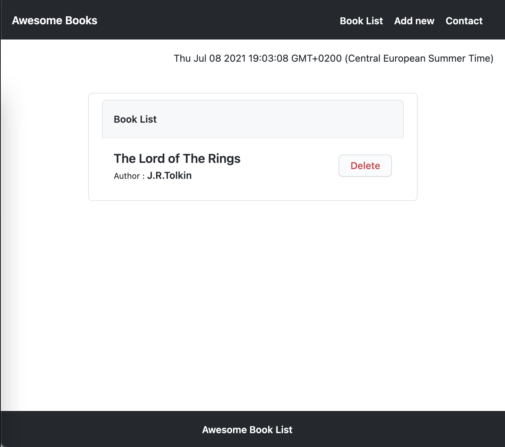

# Awsome book

> Basic exercise on using JavaScript and browser local storage in the form of a Books listing web app.

This project is 1. one in series where we apply pair programming and implement user requirements from project specification.
1. Create a collection that keeps a list of books.
2. Create a function to add a new book to the collection, with title and author.
3. Create a function to remove a book from the collection.
4. Display all books saved in the collection in the top part of the page.
5. Make sure that when a user clicks the "Add" button: 
    1. A new book is added to the collection.
    2. The new book is displayed on the page.
    3. Make sure that when a user clicks the "Remove" button:
    4. The correct book is removed from the collection.
    5. The correct book disappears from the page.
6. Make sure that data is preserved in the browser's memory by using localStorage.

## Built With

- Javascript

## Live Demo

[Live Demo Link](https://moise10r.github.io/Awesome_Book/)

## Getting Started

To get a local copy up and running, follow these simple steps.
1. Copy and paste the link to your terminal: `git@github.com:moise10r/Awesome_Book.git && cd Awesome_Book.`
2. Open code in your text editor and use 'Live server' or open index.html file in your browser.
3. In input fields, enter the author and title of the book and click on the 'Add Book' button.

## Authors

👤 NGANULO RUSHANIKA Moise

- GitHub: [@githubhandle](https://github.com/moise10r)
- Twitter: [@twitterhandle](https://twitter.com/MRushanika)
- LinkedIn: [LinkedIn](https://www.linkedin.com/in/nganulo-rushanika-mo%C3%AFse-626139197/)

👤 MARIJAN BRVAR

- GitHub: [@githubhandle](https://github.com/marijanbrvar)
- Twitter: [@twitterhandle](https://twitter.com/marijanbrvar)
- LinkedIn: [LinkedIn](https://linkedin.com/in/marijanbrvar)

## 🤝 Contributing

Contributions, issues, and feature requests are welcome!

Feel free to check the [issues page](https://github.com/moise10r/Awesome_Book/issues).

## Show your support

Give a ⭐️ if you like this project!

## 📝 License

This project is [MIT](https://github.com/moise10r/Awesome_Book/blob/feature/LICENSE) licensed.